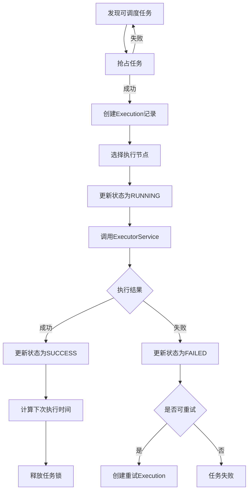

# 核心概念详解

基于您的疑问，我来详细解释这几个核心概念：

## 1. 本机抢占本机执行 - 代码在哪里？

### 部署方式对比

**本机抢占本机执行**（代码在 `cmd/local_scheduler/main.go`）：
```
┌─────────────────────────────┐
│     单个服务器进程           │
│  ┌─────────┐ ┌─────────┐    │
│  │调度器   │ │执行器   │    │
│  │Scheduler│ │Executor │    │
│  └─────────┘ └─────────┘    │
│       │         │           │
│       └─── 内存调用 ───┘     │
└─────────────────────────────┘
```

**本机抢占异地执行**（代码在 `cmd/distributed_scheduler/main.go`）：
```
┌─────────────────┐       ┌─────────────────┐
│  调度中心服务器  │       │  执行节点服务器  │
│   ┌─────────┐   │       │   ┌─────────┐   │
│   │调度器   │   │ gRPC  │   │执行器   │   │
│   │Scheduler│   ├──────►│   │Executor │   │
│   └─────────┘   │       │   └─────────┘   │
└─────────────────┘       └─────────────────┘
```

### 使用场景

| 模式 | 适用场景 | 优点 | 缺点 |
|------|----------|------|------|
| 本机抢占本机执行 | 轻量级任务、单机部署 | 无网络开销、简单易维护 | 不可水平扩展 |
| 本机抢占异地执行 | 重型任务、分布式集群 | 可水平扩展、资源隔离 | 网络开销、复杂度高 |

## 2. "抢占"的含义

### 抢占 ≠ 简单的赋值

**您的理解基本正确，但抢占不仅仅是设置`schedule_node`，而是一个原子的CAS操作**：

```sql
-- 抢占的完整SQL（关键是WHERE条件）
UPDATE task 
SET status = 'PREEMPTED',           -- 状态变更
    schedule_node = 'scheduler-001', -- 设置调度节点ID  
    version = version + 1,           -- 版本号递增（乐观锁）
    utime = NOW()                    -- 更新时间
WHERE id = 1 
  AND version = 123                  -- 版本号匹配（CAS的核心）
  AND status = 'ACTIVE';             -- 只能抢占ACTIVE状态的任务
```

### 抢占的核心特征

1. **原子性**：要么完全成功，要么完全失败
2. **唯一性**：同一时刻只有一个调度器能成功抢占
3. **版本控制**：通过版本号实现乐观锁机制

### 抢占失败的情况

```go
func (repo *TaskRepository) PreemptTask(ctx context.Context, taskID int64, scheduleNode string, version int64) error {
    result := repo.db.Exec(`
        UPDATE task 
        SET status = ?, schedule_node = ?, version = version + 1, utime = NOW()
        WHERE id = ? AND version = ? AND status = ?`,
        TaskStatusPreempted, scheduleNode, taskID, version, TaskStatusActive)
    
    if result.RowsAffected == 0 {
        return ErrTaskAlreadyPreempted // 抢占失败：已被其他节点抢占或版本号不匹配
    }
    
    return nil // 抢占成功
}
```

## 3. "调度"的含义

### 调度 = 创建执行快照 + 触发执行

**您的理解也基本正确，调度就是将execution记录创建并调用ExecutorService**：

```go
func (s *Scheduler) scheduleTask(ctx context.Context, task *Task) error {
    // 1. 创建execution记录（任务执行的快照）
    execution := &Execution{
        TaskID:       task.ID,           // 关联任务ID
        TaskName:     task.Name,         // 任务名称快照
        Status:       ExecutionStatusPrepare,
        Params:       task.Params,       // 参数快照
        RetryConfig:  task.RetryConfig,  // 重试配置快照
        ExecutorNode: selectedNode,      // 执行节点
        CreateTime:   time.Now(),
    }
    
    // 插入数据库
    err := s.executionRepo.Create(ctx, execution)
    
    // 2. 调用ExecutorService执行任务
    // 本机执行：内存调用
    result := s.localExecutor.Execute(ctx, &ExecuteRequest{
        EID:      execution.ID,
        TaskName: task.Name,
        Params:   task.Params,
    })
    
    // 异地执行：gRPC调用
    result := s.executorClient.Execute(ctx, &grpc.ExecuteRequest{
        Eid:      execution.ID,
        TaskName: task.Name,
        Params:   task.Params,
    })
    
    // 3. 更新执行状态
    s.executionRepo.UpdateStatus(ctx, execution.ID, result.Status)
    
    return nil
}
```

### Execution表的作用

**Execution表不仅仅是快照，它是任务执行的完整生命周期记录**：

| 字段 | 作用 | 举例 |
|------|------|------|
| `id` | 执行唯一标识 | 1001 |
| `task_id` | 关联的任务ID | 1（来自task表） |
| `task_name` | 任务名快照 | "user_data_sync" |
| `status` | 执行状态 | PREPARE → RUNNING → SUCCESS |
| `params` | 执行参数快照 | `{"offset": "0", "limit": "1000"}` |
| `executor_node` | 执行节点 | "executor-001" |
| `progress` | 执行进度 | 0 → 50 → 100 |
| `result` | 执行结果 | "同步完成1000条记录" |
| `retry_cnt` | 重试次数 | 0 → 1 → 2 |

### 调度的完整流程



## 4. 具体代码示例对比

### 本地执行示例
```go
// cmd/local_scheduler/main.go
func (ls *LocalScheduler) scheduleTask(task *Task) {
    // 1. 创建execution
    execution := createExecution(task)
    
    // 2. 本地调用（无网络开销）
    result := ls.localExecutor.Execute(execution)
    
    // 3. 处理结果
    handleResult(execution, result)
}
```

### 分布式执行示例
```go
// cmd/distributed_scheduler/main.go  
func (ds *DistributedScheduler) scheduleTask(task *Task) {
    // 1. 创建execution
    execution := createExecution(task)
    
    // 2. 选择执行节点
    node := ds.loadBalancer.SelectNode(task)
    
    // 3. gRPC远程调用
    client := ds.executorClients[node]
    result := client.Execute(ctx, &grpc.ExecuteRequest{
        Eid: execution.ID,
        TaskName: task.Name,
        Params: task.Params,
    })
    
    // 4. 处理结果
    handleResult(execution, result)
}
```

## 5. 总结

1. **抢占**：通过CAS操作原子地获取任务的执行权限
2. **调度**：创建执行快照并触发任务执行
3. **本机执行**：调度器和执行器在同一进程，内存调用
4. **异地执行**：调度器通过gRPC调用远程执行节点

这种设计的核心优势是：
- **并发安全**：多个调度器不会重复执行同一任务
- **状态跟踪**：每次执行都有完整的生命周期记录
- **扩展性**：支持从单机到分布式的平滑演进 