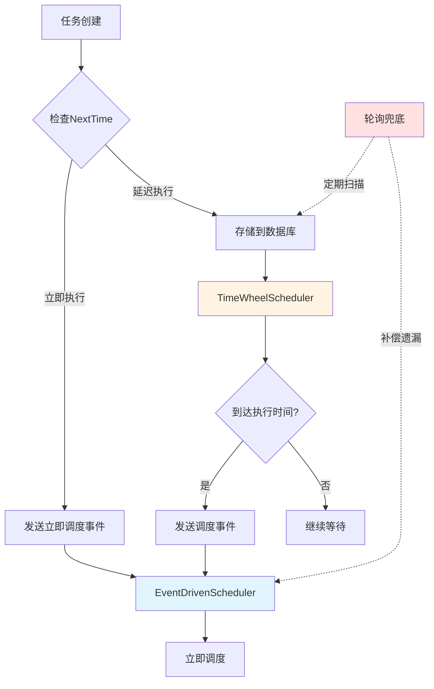
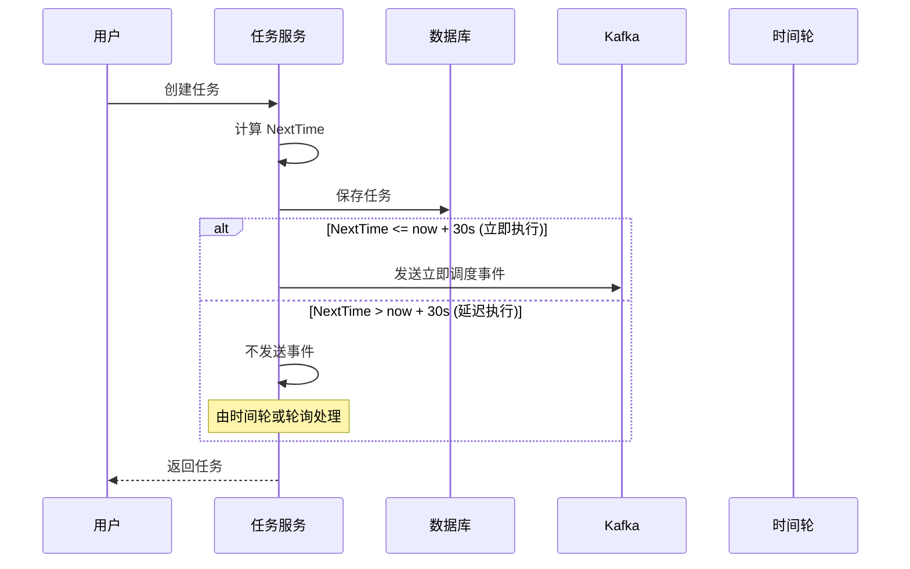
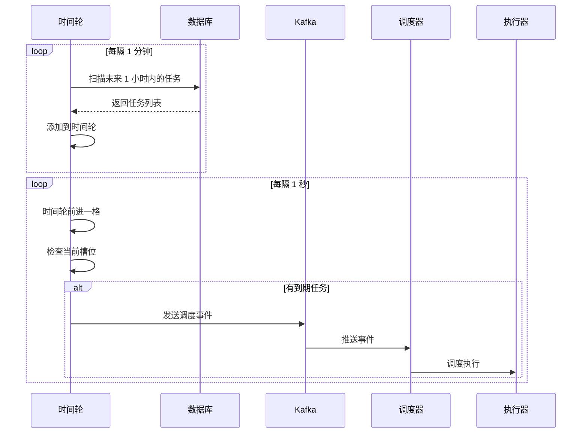
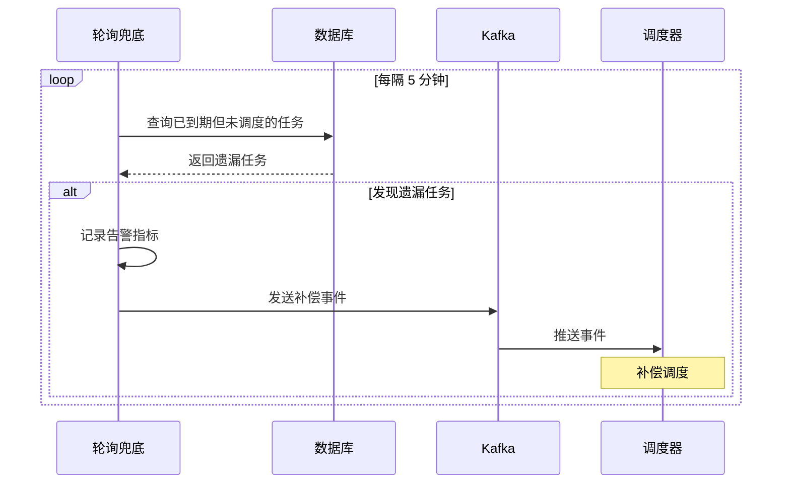

# 事件驱动模式下的定时调度解决方案

## 🎯 核心问题

在事件驱动模式下，任务创建时会立即发送事件并调度，但这带来一个关键问题：

**如何确保任务在指定的时间（NextTime）被调度？**

### 问题场景

```go
// 场景 1：定时任务
task := Task{
    Name:     "每天凌晨1点执行",
    CronExpr: "0 0 1 * * *",
    NextTime: 1732665600000,  // 2025-11-27 01:00:00
}

// 问题：任务创建时间是 2025-11-26 10:00:00
// 如果立即发送事件并调度，会导致任务提前执行！
```

```go
// 场景 2：延迟任务
task := Task{
    Name:     "30分钟后执行",
    CronExpr: "@once",
    NextTime: time.Now().Add(30 * time.Minute).UnixMilli(),
}

// 问题：任务创建后立即调度，无法实现延迟效果
```

---

## 🏗️ 解决方案架构

### 方案对比

| 方案 | 优点 | 缺点 | 适用场景 |
|------|------|------|---------|
| **方案1：延迟事件** | 简单，Kafka原生支持 | 精度低，不适合长延迟 | 短延迟任务（< 1小时） |
| **方案2：定时轮询** | 可靠，精度高 | 仍有轮询开销 | 所有场景 |
| **方案3：时间轮** | 高效，精度高 | 实现复杂，内存占用 | 高并发场景 |
| **方案4：混合模式** | 兼顾效率和可靠性 | 架构复杂 | **推荐** |

### 推荐方案：混合模式



---

## 💻 核心实现

### 1. 任务创建时的智能分发

修改文件：`internal/service/task/service.go`

```go
package task

import (
    "context"
    "time"
    
    "gitee.com/flycash/distributed_task_platform/internal/domain"
    "gitee.com/flycash/distributed_task_platform/internal/event"
)

type service struct {
    repo          repository.TaskRepository
    eventProducer event.TaskEventProducer
    
    // 立即调度的时间阈值（秒）
    immediateScheduleThreshold int64
}

func (s *service) Create(ctx context.Context, task domain.Task) (domain.Task, error) {
    // 1. 计算下次执行时间
    nextTime, err := task.CalculateNextTime()
    if err != nil {
        return domain.Task{}, fmt.Errorf("%w: %w", errs.ErrInvalidTaskCronExpr, err)
    }
    if nextTime.IsZero() {
        return domain.Task{}, errs.ErrInvalidTaskCronExpr
    }
    task.NextTime = nextTime.UnixMilli()
    
    // 2. 创建任务
    createdTask, err := s.repo.Create(ctx, task)
    if err != nil {
        return domain.Task{}, err
    }
    
    // 3. 智能分发：判断是否需要立即调度
    now := time.Now().UnixMilli()
    delaySeconds := (createdTask.NextTime - now) / 1000
    
    if delaySeconds <= s.immediateScheduleThreshold {
        // 立即调度（NextTime 在阈值内，如 30 秒）
        go s.publishImmediateScheduleEvent(createdTask)
    } else {
        // 延迟调度（由时间轮或轮询兜底处理）
        s.logger.Info("任务将延迟调度",
            elog.Int64("taskID", createdTask.ID),
            elog.Int64("delaySeconds", delaySeconds))
    }
    
    return createdTask, nil
}

func (s *service) publishImmediateScheduleEvent(task domain.Task) {
    ctx, cancel := context.WithTimeout(context.Background(), 3*time.Second)
    defer cancel()
    
    event := event.TaskCreatedEvent{
        TaskID:    task.ID,
        Task:      task,
        Timestamp: time.Now().UnixMilli(),
        Source:    "immediate_schedule",
    }
    
    if err := s.eventProducer.PublishTaskCreated(ctx, event); err != nil {
        s.logger.Error("发布立即调度事件失败",
            elog.Int64("taskID", task.ID),
            elog.FieldErr(err))
    }
}
```

### 2. 时间轮调度器

创建文件：`internal/service/scheduler/timewheel_scheduler.go`

```go
package scheduler

import (
    "context"
    "sync"
    "time"
    
    "gitee.com/flycash/distributed_task_platform/internal/domain"
    "gitee.com/flycash/distributed_task_platform/internal/event"
    "gitee.com/flycash/distributed_task_platform/internal/service/task"
    "github.com/gotomicro/ego/core/elog"
)

// TimeWheelScheduler 时间轮调度器
// 负责管理延迟任务，在到达执行时间时发送调度事件
type TimeWheelScheduler struct {
    taskSvc       task.Service
    eventProducer event.TaskEventProducer
    config        TimeWheelConfig
    
    // 时间轮
    wheel         *TimeWheel
    
    ctx           context.Context
    cancel        context.CancelFunc
    wg            sync.WaitGroup
    logger        *elog.Component
}

// TimeWheelConfig 时间轮配置
type TimeWheelConfig struct {
    // 时间轮参数
    TickDuration    time.Duration `yaml:"tickDuration"`    // 时间轮刻度（如 1 秒）
    WheelSize       int           `yaml:"wheelSize"`       // 时间轮大小（如 3600，表示 1 小时）
    
    // 扫描参数
    ScanInterval    time.Duration `yaml:"scanInterval"`    // 扫描数据库间隔
    ScanBatchSize   int           `yaml:"scanBatchSize"`   // 每次扫描数量
    ScanLookAhead   time.Duration `yaml:"scanLookAhead"`   // 提前扫描时间窗口
}

// NewTimeWheelScheduler 创建时间轮调度器
func NewTimeWheelScheduler(
    taskSvc task.Service,
    eventProducer event.TaskEventProducer,
    config TimeWheelConfig,
) *TimeWheelScheduler {
    ctx, cancel := context.WithCancel(context.Background())
    
    return &TimeWheelScheduler{
        taskSvc:       taskSvc,
        eventProducer: eventProducer,
        config:        config,
        wheel:         NewTimeWheel(config.TickDuration, config.WheelSize),
        ctx:           ctx,
        cancel:        cancel,
        logger:        elog.DefaultLogger.With(elog.FieldComponentName("TimeWheelScheduler")),
    }
}

// Start 启动时间轮调度器
func (s *TimeWheelScheduler) Start() error {
    s.logger.Info("启动时间轮调度器",
        elog.Duration("tickDuration", s.config.TickDuration),
        elog.Int("wheelSize", s.config.WheelSize))
    
    // 1. 启动时间轮
    s.wheel.Start(s.ctx, s.onTaskReady)
    
    // 2. 启动数据库扫描（加载延迟任务到时间轮）
    s.wg.Add(1)
    go s.scanAndLoadTasks()
    
    return nil
}

// scanAndLoadTasks 扫描数据库并加载延迟任务到时间轮
func (s *TimeWheelScheduler) scanAndLoadTasks() {
    defer s.wg.Done()
    
    ticker := time.NewTicker(s.config.ScanInterval)
    defer ticker.Stop()
    
    for {
        select {
        case <-s.ctx.Done():
            return
            
        case <-ticker.C:
            s.loadDelayedTasks()
        }
    }
}

// loadDelayedTasks 加载延迟任务
func (s *TimeWheelScheduler) loadDelayedTasks() {
    now := time.Now().UnixMilli()
    lookAheadTime := now + s.config.ScanLookAhead.Milliseconds()
    
    // 查询未来一段时间内需要执行的任务
    tasks, err := s.taskSvc.FindTasksInTimeRange(
        s.ctx,
        now,
        lookAheadTime,
        s.config.ScanBatchSize,
    )
    
    if err != nil {
        s.logger.Error("查询延迟任务失败", elog.FieldErr(err))
        return
    }
    
    if len(tasks) == 0 {
        return
    }
    
    s.logger.Info("加载延迟任务到时间轮", elog.Int("count", len(tasks)))
    
    // 添加到时间轮
    for _, task := range tasks {
        delay := time.Duration(task.NextTime-now) * time.Millisecond
        if delay < 0 {
            // 已经到期，立即发送事件
            s.onTaskReady(task)
        } else {
            s.wheel.AddTask(task, delay)
        }
    }
}

// onTaskReady 任务到达执行时间的回调
func (s *TimeWheelScheduler) onTaskReady(task domain.Task) {
    s.logger.Info("任务到达执行时间",
        elog.Int64("taskID", task.ID),
        elog.String("taskName", task.Name))
    
    // 发送调度事件
    ctx, cancel := context.WithTimeout(context.Background(), 3*time.Second)
    defer cancel()
    
    event := event.TaskCreatedEvent{
        TaskID:    task.ID,
        Task:      task,
        Timestamp: time.Now().UnixMilli(),
        Source:    "timewheel",
    }
    
    if err := s.eventProducer.PublishTaskCreated(ctx, event); err != nil {
        s.logger.Error("发布调度事件失败",
            elog.Int64("taskID", task.ID),
            elog.FieldErr(err))
    }
}

// Stop 停止时间轮调度器
func (s *TimeWheelScheduler) Stop() error {
    s.logger.Info("停止时间轮调度器")
    s.cancel()
    s.wheel.Stop()
    s.wg.Wait()
    return nil
}
```

### 3. 时间轮实现

继续在 `timewheel_scheduler.go` 中添加：

```go
// TimeWheel 时间轮
type TimeWheel struct {
    tickDuration time.Duration
    wheelSize    int
    
    // 时间轮槽位
    slots         []map[int64]domain.Task  // 每个槽位存储任务
    currentPos    int
    
    ticker        *time.Ticker
    taskCallback  func(domain.Task)
    
    mu            sync.RWMutex
    logger        *elog.Component
}

// NewTimeWheel 创建时间轮
func NewTimeWheel(tickDuration time.Duration, wheelSize int) *TimeWheel {
    slots := make([]map[int64]domain.Task, wheelSize)
    for i := range slots {
        slots[i] = make(map[int64]domain.Task)
    }
    
    return &TimeWheel{
        tickDuration: tickDuration,
        wheelSize:    wheelSize,
        slots:        slots,
        currentPos:   0,
        logger:       elog.DefaultLogger.With(elog.FieldComponentName("TimeWheel")),
    }
}

// Start 启动时间轮
func (tw *TimeWheel) Start(ctx context.Context, callback func(domain.Task)) {
    tw.taskCallback = callback
    tw.ticker = time.NewTicker(tw.tickDuration)
    
    go func() {
        for {
            select {
            case <-ctx.Done():
                tw.ticker.Stop()
                return
                
            case <-tw.ticker.C:
                tw.tick()
            }
        }
    }()
}

// tick 时间轮前进一格
func (tw *TimeWheel) tick() {
    tw.mu.Lock()
    
    // 获取当前槽位的任务
    tasks := tw.slots[tw.currentPos]
    
    // 清空当前槽位
    tw.slots[tw.currentPos] = make(map[int64]domain.Task)
    
    // 前进到下一个槽位
    tw.currentPos = (tw.currentPos + 1) % tw.wheelSize
    
    tw.mu.Unlock()
    
    // 触发任务回调
    for _, task := range tasks {
        go tw.taskCallback(task)
    }
}

// AddTask 添加任务到时间轮
func (tw *TimeWheel) AddTask(task domain.Task, delay time.Duration) {
    if delay < 0 {
        delay = 0
    }
    
    // 计算任务应该放在哪个槽位
    ticks := int(delay / tw.tickDuration)
    if ticks >= tw.wheelSize {
        // 超出时间轮范围，放在最后一个槽位
        // 实际应该使用多层时间轮，这里简化处理
        ticks = tw.wheelSize - 1
    }
    
    tw.mu.Lock()
    defer tw.mu.Unlock()
    
    slotIndex := (tw.currentPos + ticks) % tw.wheelSize
    tw.slots[slotIndex][task.ID] = task
    
    tw.logger.Debug("添加任务到时间轮",
        elog.Int64("taskID", task.ID),
        elog.Int("slotIndex", slotIndex),
        elog.Duration("delay", delay))
}

// Stop 停止时间轮
func (tw *TimeWheel) Stop() {
    if tw.ticker != nil {
        tw.ticker.Stop()
    }
}
```

### 4. 事件驱动调度器增强

修改 `event_driven_scheduler.go`，增加时间检查：

```go
// handleEvent 处理单个事件（增加时间检查）
func (s *EventDrivenScheduler) handleEvent(ctx context.Context, taskEvent event.TaskCreatedEvent) error {
    startTime := time.Now()
    
    // 1. 检查任务是否到达执行时间
    now := time.Now().UnixMilli()
    if taskEvent.Task.NextTime > now {
        delayMs := taskEvent.Task.NextTime - now
        
        // 如果延迟时间较短，等待后再调度
        if delayMs < 60000 { // 小于 1 分钟
            s.logger.Info("任务未到执行时间，等待后调度",
                elog.Int64("taskID", taskEvent.TaskID),
                elog.Int64("delayMs", delayMs))
            
            time.Sleep(time.Duration(delayMs) * time.Millisecond)
        } else {
            // 延迟时间较长，不应该在这里处理
            s.logger.Warn("任务延迟时间过长，跳过调度",
                elog.Int64("taskID", taskEvent.TaskID),
                elog.Int64("delayMs", delayMs))
            return fmt.Errorf("任务未到执行时间")
        }
    }
    
    // 2. 负载检查
    if _, ok := s.loadChecker.Check(); !ok {
        s.logger.Warn("负载过高，延迟处理",
            elog.Int64("taskID", taskEvent.TaskID))
        time.Sleep(1 * time.Second)
        return fmt.Errorf("负载过高")
    }
    
    // 3. 调度任务
    scheduleCtx := s.newContext(taskEvent.Task)
    err := s.runner.Run(scheduleCtx, taskEvent.Task)
    
    // 4. 记录指标
    duration := time.Since(startTime)
    if err != nil {
        s.logger.Error("调度任务失败",
            elog.Int64("taskID", taskEvent.TaskID),
            elog.Duration("duration", duration),
            elog.FieldErr(err))
        s.metrics.RecordScheduleFailed("event_driven")
        return err
    }
    
    s.logger.Info("调度任务成功",
        elog.Int64("taskID", taskEvent.TaskID),
        elog.Duration("duration", duration))
    s.metrics.RecordScheduleSuccess("event_driven", duration)
    
    return nil
}
```

### 5. 轮询兜底增强

修改 `event_driven_scheduler.go` 中的轮询兜底：

```go
// pollingFallback 轮询兜底机制（增强版）
func (s *EventDrivenScheduler) pollingFallback() {
    defer s.wg.Done()
    
    s.logger.Info("启动轮询兜底机制",
        elog.Duration("interval", s.config.PollingInterval))
    
    ticker := time.NewTicker(s.config.PollingInterval)
    defer ticker.Stop()
    
    for {
        select {
        case <-s.ctx.Done():
            return
            
        case <-ticker.C:
            s.logger.Debug("执行轮询兜底")
            
            // 查询已到执行时间但未被调度的任务
            now := time.Now().UnixMilli()
            tasks, err := s.taskSvc.SchedulableTasks(
                s.ctx,
                60000, // 60秒超时
                s.config.PollingBatchSize,
            )
            
            if err != nil {
                s.logger.Error("轮询查询任务失败", elog.FieldErr(err))
                continue
            }
            
            // 过滤：只处理已到执行时间的任务
            readyTasks := make([]domain.Task, 0)
            for _, t := range tasks {
                if t.NextTime <= now {
                    readyTasks = append(readyTasks, t)
                }
            }
            
            if len(readyTasks) > 0 {
                s.logger.Warn("轮询发现遗漏任务", elog.Int("count", len(readyTasks)))
                s.metrics.RecordPollingFallback(len(readyTasks))
                
                // 将任务转换为事件
                for _, t := range readyTasks {
                    taskEvent := event.TaskCreatedEvent{
                        TaskID:    t.ID,
                        Task:      t,
                        Timestamp: time.Now().UnixMilli(),
                        Source:    "polling_fallback",
                    }
                    
                    select {
                    case s.eventChan <- taskEvent:
                    case <-s.ctx.Done():
                        return
                    }
                }
            }
        }
    }
}
```

---

## 🔄 完整架构流程

### 任务创建流程



### 延迟任务调度流程



### 轮询兜底流程



---

## ⚙️ 配置文件

修改 `config/config.yaml`：

```yaml
scheduler:
  mode: event_driven
  
  # 任务服务配置
  task:
    # 立即调度阈值（秒）
    # NextTime 在此阈值内的任务会立即发送事件
    immediateScheduleThreshold: 30
  
  # 事件驱动配置
  eventDriven:
    enabled: true
    workerCount: 20
    eventBufferSize: 1000
    renewInterval: 30s
    
    # 轮询兜底
    enablePolling: true
    pollingInterval: 5m
    pollingBatchSize: 100
  
  # 时间轮配置
  timeWheel:
    enabled: true
    
    # 时间轮参数
    tickDuration: 1s        # 时间轮刻度：1 秒
    wheelSize: 3600         # 时间轮大小：3600 格（1 小时）
    
    # 扫描参数
    scanInterval: 1m        # 每分钟扫描一次数据库
    scanBatchSize: 1000     # 每次扫描 1000 个任务
    scanLookAhead: 1h       # 提前加载未来 1 小时的任务
```

---

## 📊 方案对比

### 不同延迟时间的处理策略

| 延迟时间 | 处理策略 | 精度 | 资源消耗 |
|---------|---------|------|---------|
| **0-30 秒** | 立即发送事件 | 毫秒级 | 低 |
| **30 秒-1 小时** | 时间轮调度 | 秒级 | 中 |
| **1 小时以上** | 数据库 + 定期扫描 | 分钟级 | 低 |

### 性能对比

| 指标 | 纯轮询模式 | 纯事件驱动 | 混合模式 |
|------|-----------|-----------|---------|
| **立即任务延迟** | 15 秒 | < 1 秒 | < 1 秒 |
| **延迟任务精度** | 30 秒 | ❌ 不支持 | 1 秒 |
| **数据库 QPS** | 持续查询 | 仅创建时 | 定期扫描 |
| **内存占用** | 低 | 低 | 中 |
| **可靠性** | 高 | 中 | **高** |

---

## 🎯 最佳实践

### 1. 立即调度阈值设置

```yaml
# 推荐配置
task:
  immediateScheduleThreshold: 30  # 30 秒

# 说明：
# - 太小（如 5 秒）：很多任务走时间轮，增加复杂度
# - 太大（如 5 分钟）：时间轮压力大，内存占用高
# - 30 秒：平衡点，大部分立即任务可以直接调度
```

### 2. 时间轮参数调优

```yaml
timeWheel:
  # 场景 1：高精度短延迟（如秒级定时任务）
  tickDuration: 1s
  wheelSize: 3600      # 1 小时
  scanLookAhead: 1h
  
  # 场景 2：低精度长延迟（如分钟级定时任务）
  tickDuration: 10s
  wheelSize: 360       # 1 小时
  scanLookAhead: 2h
```

### 3. 监控指标

```yaml
# 关键指标
metrics:
  # 调度延迟
  - scheduler_schedule_latency_seconds
    labels: [source]  # immediate, timewheel, polling
  
  # 时间轮状态
  - timewheel_tasks_total          # 时间轮中的任务数
  - timewheel_slot_utilization     # 槽位利用率
  
  # 轮询兜底
  - polling_fallback_tasks_total   # 轮询发现的遗漏任务数
  - polling_fallback_rate          # 轮询兜底触发率
```

### 4. 告警规则

```yaml
# Prometheus 告警
groups:
  - name: timing_alerts
    rules:
      # 延迟任务调度不及时
      - alert: DelayedTaskScheduleLate
        expr: |
          (time() - task_next_time_seconds) > 60
        for: 5m
        annotations:
          summary: "延迟任务调度超时"
      
      # 时间轮任务积压
      - alert: TimeWheelBacklog
        expr: timewheel_tasks_total > 10000
        for: 5m
        annotations:
          summary: "时间轮任务积压"
      
      # 轮询兜底频繁触发
      - alert: PollingFallbackHigh
        expr: rate(polling_fallback_tasks_total[5m]) > 10
        for: 10m
        annotations:
          summary: "轮询兜底频繁触发，可能事件丢失"
```

---

## 🔍 故障处理

### 问题 1：任务延迟调度

**现象**：任务创建后，在 NextTime 之后很久才被调度

**排查**：
```bash
# 1. 检查时间轮状态
curl http://scheduler:8080/metrics | grep timewheel

# 2. 检查轮询兜底触发情况
curl http://scheduler:8080/metrics | grep polling_fallback

# 3. 检查事件消费延迟
curl http://scheduler:8080/metrics | grep event_latency
```

**解决**：
- 增加时间轮扫描频率
- 降低轮询兜底间隔
- 增加事件消费者数量

### 问题 2：任务提前调度

**现象**：任务在 NextTime 之前就被调度了

**排查**：
```bash
# 检查任务创建时的 NextTime 计算
# 检查事件发布逻辑
# 检查调度器的时间检查逻辑
```

**解决**：
- 确保任务创建时正确计算 NextTime
- 在调度器中增加时间检查
- 对于延迟任务，不要立即发送事件

### 问题 3：时间轮内存占用高

**现象**：时间轮占用内存过大

**排查**：
```bash
# 检查时间轮中的任务数量
curl http://scheduler:8080/metrics | grep timewheel_tasks_total
```

**解决**：
- 减小 scanLookAhead 时间窗口
- 增大 tickDuration（降低精度）
- 使用多层时间轮

---

## 📚 总结

### 核心设计

1. **智能分发**：任务创建时根据 NextTime 决定处理策略
   - 立即执行（≤ 30 秒）：发送事件
   - 延迟执行（> 30 秒）：时间轮管理

2. **时间轮调度**：高效管理延迟任务
   - 定期扫描数据库加载任务
   - 时间轮前进触发调度事件
   - 内存占用可控

3. **轮询兜底**：保证可靠性
   - 定期扫描遗漏任务
   - 补偿调度
   - 监控告警

### 优势

| 优势 | 说明 |
|------|------|
| **高效** | 立即任务 < 1 秒调度 |
| **精确** | 延迟任务秒级精度 |
| **可靠** | 轮询兜底保证不丢任务 |
| **可扩展** | 时间轮可水平扩展 |
| **低成本** | 数据库压力小 |

### 实施建议

1. ✅ 先实现智能分发（立即 vs 延迟）
2. ✅ 再实现时间轮调度器
3. ✅ 保留轮询兜底机制
4. ✅ 完善监控和告警
5. ✅ 灰度发布，逐步切换

---

**相关文档**：
- [调度器事件驱动改造指南](./scheduler_event_driven_guide.md)
- [事件驱动分析](./event_driven_analysis.md)

**版本**：v1.0  
**日期**：2025-11-27
