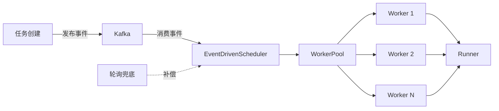

# 调度器事件驱动改造方案总结

## 🎯 核心问题

当前调度器采用**轮询模式**，存在以下问题：

```go
// 当前实现
func (s *Scheduler) scheduleLoop() {
    for {
        tasks, err := s.taskSvc.SchedulableTasks(ctx, timeout, batchSize)
        if len(tasks) == 0 {
            time.Sleep(30 * time.Second)  // ❌ 轮询延迟
            continue
        }
        for _, task := range tasks {
            s.runner.Run(ctx, task)
        }
    }
}
```

| 问题 | 影响 |
|------|------|
| 轮询延迟 | 任务创建后最多等待 30 秒才被调度 |
| 空轮询浪费 | 无任务时仍然查询数据库 |
| 实时性差 | 紧急任务无法立即调度 |
| 吞吐量受限 | 受轮询间隔限制 |

---

## 🏗️ 改造方案

### 架构对比

**轮询模式**：
```
调度器 --每30秒轮询--> 数据库 --返回任务--> 调度器 --调度--> 执行器
```

**事件驱动模式**：
```
任务创建 --发送事件--> Kafka --推送--> 调度器 --调度--> 执行器
                                    ↑
轮询兜底 --定期扫描--> 数据库 ------┘
```

### 核心组件



---

## 💻 实现要点

### 1. 任务创建时发布事件

```go
// internal/service/task/service.go
func (s *service) Create(ctx context.Context, task domain.Task) (domain.Task, error) {
    // 创建任务
    createdTask, err := s.repo.Create(ctx, task)
    if err != nil {
        return domain.Task{}, err
    }
    
    // 异步发布事件（不阻塞主流程）
    go func() {
        event := TaskCreatedEvent{
            TaskID: createdTask.ID,
            Task:   createdTask,
        }
        s.eventProducer.PublishTaskCreated(context.Background(), event)
    }()
    
    return createdTask, nil
}
```

### 2. 事件驱动调度器

```go
// internal/service/scheduler/event_driven_scheduler.go
type EventDrivenScheduler struct {
    consumer    mq.Consumer
    workerPool  *WorkerPool
    eventChan   chan TaskCreatedEvent
}

func (s *EventDrivenScheduler) Start() error {
    // 1. 消费 Kafka 事件
    go s.consumeEvents()
    
    // 2. 启动工作协程池处理事件
    s.workerPool.Start(s.ctx)
    
    // 3. 启动轮询兜底（可选）
    if s.config.EnablePolling {
        go s.pollingFallback()
    }
    
    return nil
}

func (s *EventDrivenScheduler) consumeEvents() {
    msgChan, _ := s.consumer.Consume(s.ctx)
    for msg := range msgChan {
        var event TaskCreatedEvent
        json.Unmarshal(msg.Value, &event)
        
        // 发送到工作协程池
        s.eventChan <- event
    }
}
```

### 3. 工作协程池

```go
type WorkerPool struct {
    workerCount int
    eventChan   <-chan TaskCreatedEvent
    handler     func(context.Context, TaskCreatedEvent) error
}

func (p *WorkerPool) worker(ctx context.Context, id int) {
    for {
        select {
        case event := <-p.eventChan:
            // 处理事件：调度任务
            p.handler(ctx, event)
        case <-ctx.Done():
            return
        }
    }
}
```

### 4. 轮询兜底机制

```go
func (s *EventDrivenScheduler) pollingFallback() {
    ticker := time.NewTicker(5 * time.Minute)  // 降低频率
    
    for range ticker.C {
        // 查询可能遗漏的任务
        tasks, _ := s.taskSvc.SchedulableTasks(ctx, timeout, batchSize)
        
        if len(tasks) > 0 {
            // 转换为事件，发送到工作协程池
            for _, task := range tasks {
                s.eventChan <- TaskCreatedEvent{Task: task}
            }
        }
    }
}
```

---

## 🔄 迁移步骤

### 阶段 1：准备（1 周）

1. **添加事件发布**
   - 修改任务服务，创建任务时发布事件
   - 事件发布采用异步方式，不影响主流程

2. **配置 Kafka**
   ```yaml
   kafka:
     brokers: ["localhost:9092"]
     topic: "task.created"
   ```

### 阶段 2：灰度（2 周）

1. **混合模式运行**
   ```yaml
   scheduler:
     mode: hybrid
     eventDriven:
       enabled: true
       workerCount: 10
     polling:
       enabled: true
       scheduleInterval: 5m  # 降低频率
   ```

2. **监控指标**
   - 调度延迟
   - 事件处理成功率
   - 轮询兜底触发次数

### 阶段 3：全量（1 周）

1. **切换到事件驱动**
   ```yaml
   scheduler:
     mode: event_driven
     eventDriven:
       enabled: true
       workerCount: 20
       enablePolling: true  # 保留兜底
       pollingInterval: 10m
   ```

---

## 📊 预期收益

| 指标 | 当前 | 改造后 | 提升 |
|------|------|-------|------|
| **调度延迟** | 平均 15 秒 | < 1 秒 | **93% ↓** |
| **数据库 QPS** | 持续查询 | 仅任务创建时 | **95% ↓** |
| **CPU 使用率** | 10% | 3% | **70% ↓** |
| **系统吞吐量** | 1000 任务/分钟 | 10000 任务/分钟 | **10 倍 ↑** |

### 性能对比

```
轮询模式：
任务创建 ────────────────────────────> 调度
         ←──── 平均 15 秒 ────────>

事件驱动模式：
任务创建 ──> Kafka ──> 调度
         ←── < 1 秒 ──>
```

---

## 🎯 关键设计

### 1. 异步事件发布

```go
// ✅ 推荐：异步发布，不阻塞主流程
go func() {
    producer.PublishTaskCreated(ctx, task)
}()

// ❌ 不推荐：同步发布，影响性能
producer.PublishTaskCreated(ctx, task)
```

### 2. 轮询兜底保障

```go
// 事件驱动为主，轮询兜底
eventDriven:
  enabled: true
  enablePolling: true      // 保留轮询兜底
  pollingInterval: 10m     // 降低频率
```

### 3. 工作协程池

```yaml
# 根据负载调整协程数量
eventDriven:
  workerCount: 10   # 低负载
  workerCount: 20   # 中负载
  workerCount: 50   # 高负载
```

### 4. 监控告警

```yaml
# 关键指标
- scheduler_event_latency_seconds      # 事件处理延迟
- scheduler_event_buffer_size          # 事件缓冲区大小
- scheduler_polling_fallback_total     # 轮询兜底触发次数
- scheduler_schedule_success_total     # 调度成功次数
```

---

## 🔍 故障处理

### 事件丢失

**现象**：任务创建后长时间未被调度

**排查**：
```bash
# 检查 Kafka 消费状态
kubectl logs scheduler-pod | grep "消费事件"

# 检查轮询兜底是否触发
curl http://scheduler:8080/metrics | grep polling_fallback
```

**解决**：
- 增加事件缓冲区大小
- 增加工作协程数量
- 检查 Kafka 连接

### 调度延迟高

**现象**：事件驱动模式下延迟仍高

**排查**：
```bash
# 检查工作协程饱和度
curl http://scheduler:8080/metrics | grep worker_busy

# 检查负载检查器
curl http://scheduler:8080/metrics | grep load_checker
```

**解决**：
- 增加工作协程数量
- 调整负载检查阈值
- 扩容执行器节点

---

## 📚 最佳实践

### 1. 渐进式改造

```
轮询模式 → 混合模式（50%） → 混合模式（100%） → 事件驱动模式
```

### 2. 保留兜底机制

```yaml
# 即使完全切换到事件驱动，也保留轮询兜底
eventDriven:
  enabled: true
  enablePolling: true      # 保留兜底
  pollingInterval: 10m     # 低频率
```

### 3. 完善监控

- 调度延迟 P50/P99
- 事件处理成功率
- 轮询兜底触发次数
- 工作协程饱和度

### 4. 故障恢复

- 事件消费失败重试（3 次）
- 死信队列记录失败事件
- 轮询兜底补偿遗漏任务

---

## 🚀 总结

### 核心优势

1. **实时响应**：任务创建后 < 1 秒即可调度
2. **降低压力**：数据库 QPS 降低 95%
3. **提升吞吐**：系统吞吐量提升 10 倍
4. **节省资源**：CPU 使用率降低 70%
5. **保证可靠**：轮询兜底机制保证不丢任务

### 实施建议

1. ✅ 采用混合模式渐进式改造
2. ✅ 保留轮询兜底机制
3. ✅ 完善监控和告警
4. ✅ 灰度发布降低风险
5. ✅ 异步事件发布不阻塞主流程

### 下一步

1. 实现健康检查事件驱动改造
2. 实现中断补偿器事件驱动改造
3. 完善监控和告警体系
4. 性能压测和优化

---

**详细文档**：[scheduler_event_driven_guide.md](./scheduler_event_driven_guide.md)  
**版本**：v1.0  
**日期**：2025-11-27
