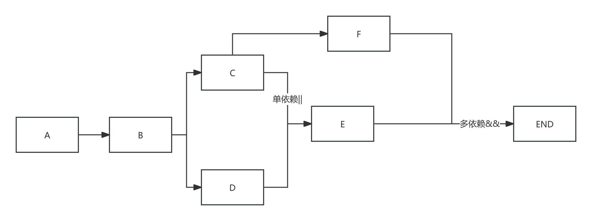

# 任务编排DSL语法说明

这是一个用于描述任务编排的领域特定语言(DSL)，支持复杂的任务依赖关系和执行流程。

## 语法规则

### 1. 任务名称
- 由英文字母、数字和下划线组成
- 必须以字母或下划线开头
- 示例：`task1`, `process_data`, `validate_input`

### 2. 基本操作符

#### 顺序执行 (`->`)
表示任务按顺序执行，前一个任务完成后才开始下一个任务。
```
task1 -> task2 -> task3
```

#### 多依赖 (`&&`)
表示任务的并行依赖，所有依赖的任务都必须完成才能继续执行。
```
task1 && task2 && task3
```
注意：AND操作符前后只能是单个任务名称。

#### 单个依赖 (`||`)
表示任务的选择执行，任意一个任务成功即可。
```
task1 || task2 || task3
```
注意：OR操作符前后只能是单个任务名称。

#### 条件执行 (`? :`)
根据前一个任务的结果决定执行哪个分支。
```
task1 ? task2 : task3
```
注意：条件操作符的三个操作数都只能是单个任务名称。

### 3. 分组操作

#### 汇聚组 (`{A,B,C}`)
表示等待所有任务完成后继续执行。
```
{task1, task2, task3} -> task4
```

### 4. 优先级控制

使用括号 `()` 来控制操作符的优先级：
```
(task1 -> task2) && (task3 -> task4)
```

### 5. 多个语句
用分号(;)分割，或者换行符

## 示例

### 简单流程

上述图对应的表达式如下
A->B->(C||D); C->{E,F}->END; D->E->END;


## 文件结构

- `TaskOrchestrationLexer.g4`: 词法分析器定义
- `TaskOrchestrationParser.g4`: 语法分析器定义

## 使用说明

1. 使用ANTLR工具生成解析器代码
2. 将DSL表达式输入到解析器中
3. 解析器会生成抽象语法树(AST)
4. 遍历AST来执行相应的任务编排逻辑

## 注意事项

- 任务名称区分大小写
- 操作符前后可以有空格
- 支持单行注释 `//`
- 括号内的表达式优先执行
- 语法限制：
  - AND(&&)操作符前后只能是单个任务名称
  - OR(||)操作符前后只能是单个任务名称
  - 条件操作符(?:)的三个操作数都只能是单个任务名称
  - 汇聚组({})中只能是单个任务
- 整个表达式，有且只有一个结束任务，也就是有且只有一个任务没有后继任务。